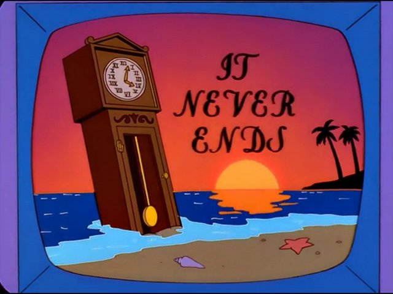

> Like the cleaning of a house...



Here we are in the year 2025 and yet another modification of Brandon Withrow's [Waveshare-version TV build](https://withrow.io/simpsons-tv-build-guide-waveshare).

This one includes some great changes from [Jeremy Whelchel's updated version](https://github.com/jeremywhelchel/simpsonstv), notably the touchscreen support and adds onto those as well for more recent Raspberry Pi OS (Bullseye) support.

Of course, as I finish and publish this project that I started mid last 2024, Bullseye is now considered legacy and superceded by Bookworm. Although I have not tested Bookworm, considering the core issue was the older players that wouldn't work, I don't see any reason why this wouldn't still work on Bookworm.

## Modern Raspberry Pi OS (Bullseye) support

The core issue in making this project in 2025 (I actually began in 2024) is that the original guide uses the legacy version of RaspberryPi OS (Buster) along with a video player `omxplayer` that no longer works on the newer version of the OS. Jeremy's version uses a newer player `mpv` that unfortunately I also could not get to work on the newest OS (Bullseye) (2024-03-12, Lite) on a PI Zero. I didn't want to rely on the legacy OS, so I wanted to see if I could get it working in the modern OS using trusty ol' [VLC][vlc].

After much thrashing here it is.

## Installation instructions

### Getting the screen to work

Despite the instructions in the [Waveshare Wiki][waveshare-wiki], using the config provided for the Bookworm and Bullesye branches of PiOS would not work for me. After lots of trial and error I ended up using the same config they had posted for the legacy Buster branch, and for whatever reason that still worked. Still use the same `dtbo` files they provide in the link above.

`config.txt`
```
gpio=0-9=a2
gpio=12-17=a2
gpio=20-25=a2
dtoverlay=dpi24
enable_dpi_lcd=1
display_default_lcd=1
extra_transpose_buffer=2
dpi_group=2
dpi_mode=87
dpi_output_format=0x7F216
hdmi_timings=480 0 26 16 10 640 0 25 10 15 0 0 0 60 0 32000000 1
dtoverlay=waveshare-28dpi-3b-4b
dtoverlay=waveshare-28dpi-3b
dtoverlay=waveshare-28dpi-4b
```

Also make sure you comment out this line in the same file:

```
#=== commenting out this line disables acceleration but allows it to work
#dtoverlay=vc4-kms-v3d
```

### Installing vlc and related package

Still logged into the Pi, install vlc by running

```
sudo apt install vlc
```

The touch script also makes use of a [simple python package](https://github.com/MatejMecka/python-vlc-http) to make communicating to VLCs http server easier. Install that with

```
pip install python-vlc-http
```

### Other notes

Chances are you'll have to update the permissions on the `start.sh` script to allow it to be run from the service. Do that with the following command:

```
chmod +x simpsonstv/start.sh
```

VLC will also not run as root from the service files, so make sure that your `.service` files have a `user` entry in them. The ones included in this repo do, but make sure the user matches the actual user you have setup on your Pi.

I am also including my full `config.txt` file. I wouldn't recommend using or copying it wholesale, but maybe some things in there will help you if you run into trouble.

I also used an [updated version of the 3D model by Freakadude](https://www.thingiverse.com/thing:5027609) that printed and worked very well.

---

_Further notes from Jeremy's version that are helpful:_

## Touchscreen player control

The [Waveshare 2.8" screen][waveshare-wiki] has capacitive touch that wasn't used in the original
build. I added a simple `touch.py` job to listen to screen events and send a
handful of commands to the video player. Be sure to add a corresponding systemd
service.

You can:
- Touch left side of screen - seek back 15 seconds
- Touch middle of screen - play / pause
- Touch right side of screen - seek forward 45 seconds
- Swipe from left to right - next video
- Swipe from right to left - previous video

## Videos on FAT partition

It's much easier to manage the videos when they are on a separate FAT partition
on the SD Card. Rather than copying over the network or mounting another thumb
drive, the card can be plugged in to a normal computer and files can be copied
to a mounted partition.

After initially flashing Raspbian (and editing `config.txt`, etc) but before first boot, which will auto-resize partition to take up all the remaining free space, create a new fat32 partition at the END of the free space. But still leaving enough room for the original linux partition to grow. I left 10GB. This was done using Gparted on a separate linux machine.

Later, once the RPpi is up and you are logged in, you can manually resize the
ext4 partition, via something like:

```
# Resize the ext4 / partition
sudo parted
> print
> resizepart 2 8G
> <ctrl-D>

# Extend the ext4 filesystem to fill up the partitioned space.
df -h
blkid
sudo resize2fs /dev/mmcblk0p2
df -h
```

Finally, auto-mount the videos data partition at `/video`
`sudo mkdir /video`

Then add the following line to `/etc/fstab`
```
  /dev/mmcblk0p3 /video vfat defaults 0 2
```

## Hardware changes

I also glued in the screen upside down, since the bezel was better covered by
the 3d printed housing that way. To invert the screen, set `display_rotate=3` in `/boot/config.txt`

Switched from Micro-USB to USB-C for the power input. Use something like this
[Adafruit USB Type-C breakout board](https://www.adafruit.com/product/4090). Make sure the breakout board has CC resistors that properly indicate 5 volts--otherwise this won't work with C-to-C cables.

[waveshare-wiki]: https://www.waveshare.com/wiki/2.8inch_DPI_LCD
[vlc]: https://www.videolan.org/vlc/